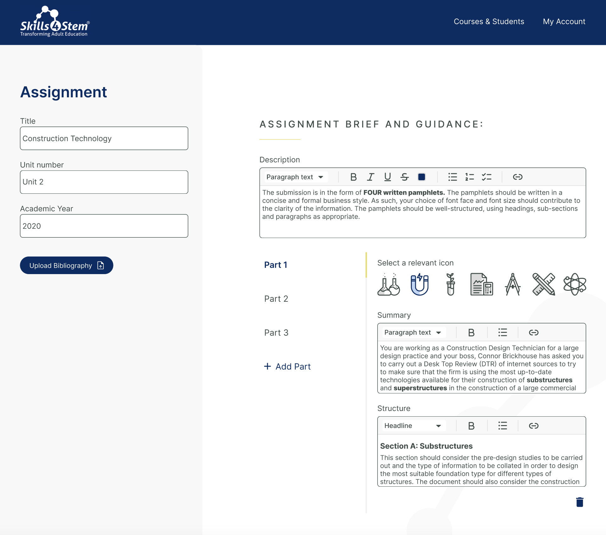
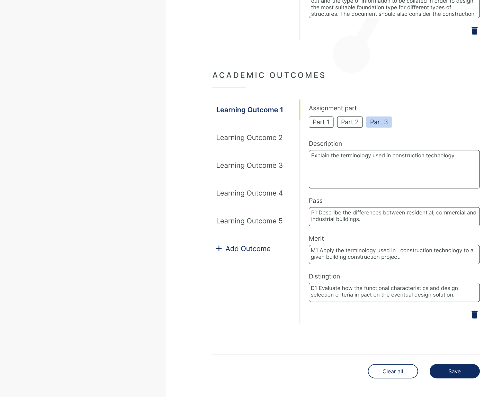
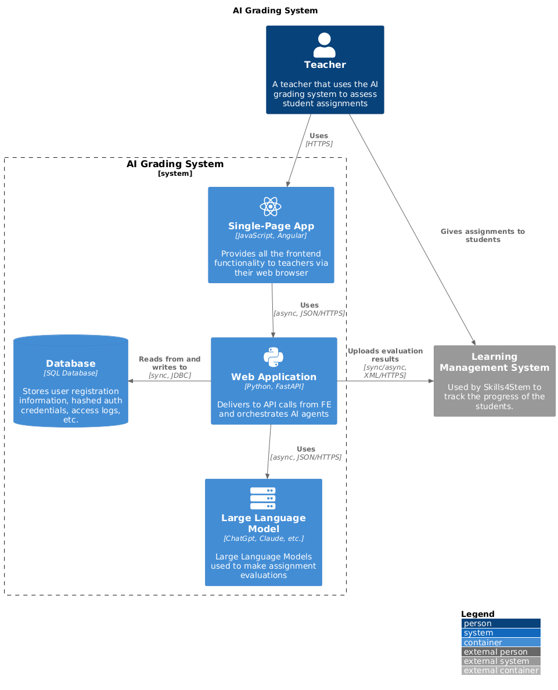
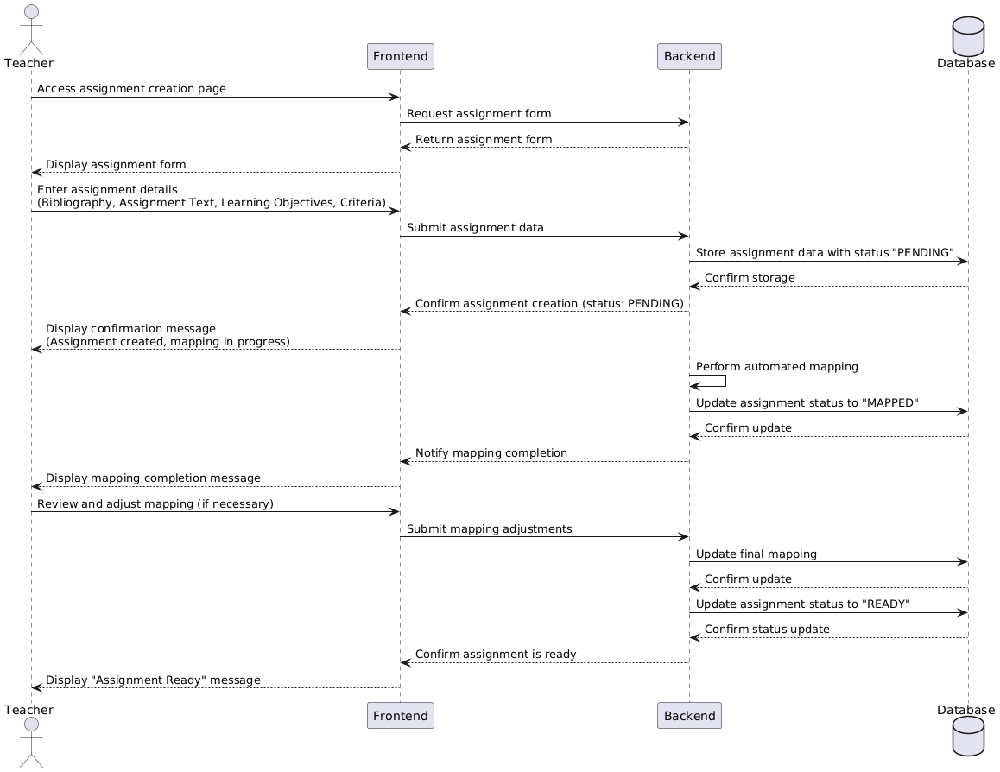
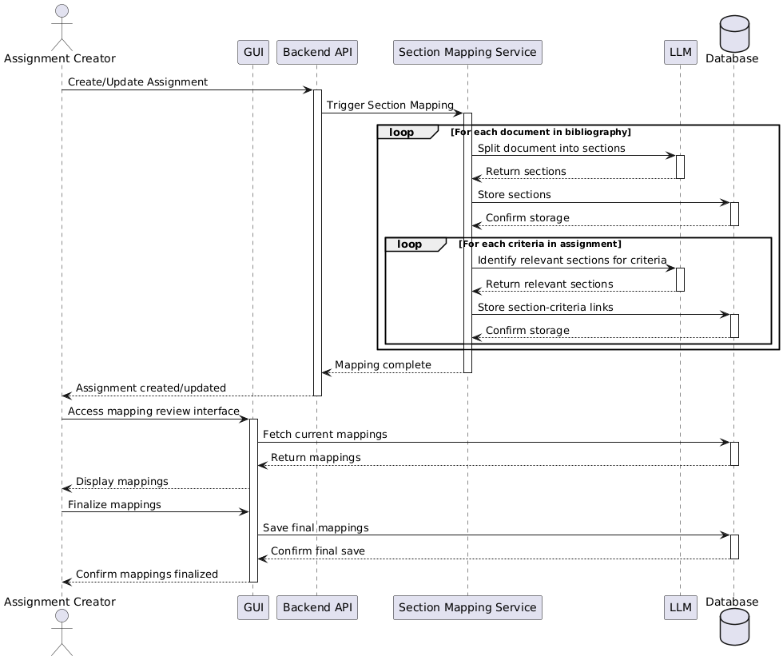
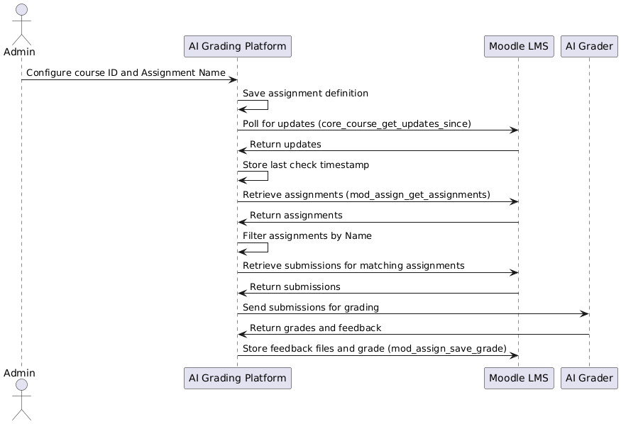

= Skills4Stem AI Assignment Grading System

== Solution Overview

== High Level Description of Main Features

=== Define Assignments
Teacher will be able to define / update assignments that the platform will be able to grade. The following screenshot depicts the main page used to define these assigments:

.Define Assignments (1 of 2)

.Define Assignments (2 of 2)

To see the whole mockup, refer to the following https://www.figma.com/proto/yidvXt8wOjyaDLsXnt9aUf/Skills4Stem?page-id=0%3A1&node-id=81-221&viewport=14%2C-162%2C0.17&t=ZNzh1D9X0sTC3ISY-1&scaling=scale-down-width&starting-point-node-id=81%3A221&content-scaling=fixed[Figma link].

To define an assignment, an user will define the following:

* Bibliography (multiple documents)
* Assignment Text
* Learning Objectives + Criteria + Essential Info for Each (essential info to be clarified) Criteria

=== Automated Section Mapping Using AI

The system employs AI to automatically map sections of the bibliography to specific grading criteria. This automated mapping consists of two main steps:

1. *Bibliography Section Splitting*: The AI analyzes the bibliography and splits it into distinct sections based on content and structure.

2. *Criteria-to-Section Mapping*: The AI then maps each grading criterion to the most relevant section(s) of the bibliography.

This process ensures that when evaluating a specific criterion, the AI focuses on the most pertinent information from the source material.

To ensure accuracy and allow for human oversight, the system includes a Graphical User Interface (GUI) for Human-In-The-Loop verification and correction of the automated mapping results:

* *Split-screen Interface*: The GUI presents a split-screen view with the selected document on the left and the grading criteria on the right.
* *Interactive Highlighting*: When a criterion is selected on the right screen, the corresponding mapped sections are highlighted on the left screen, providing a visual representation of the AI's mapping.
* *Manual Adjustment*: Users can add or remove section-criteria mappings directly through the interface, allowing for fine-tuning of the AI's output.

More details in this Figma https://www.figma.com/proto/gjZuREXbvfIackda0wxIyR/Skills4Stem?page-id=242%3A127&node-id=8606-3306&viewport=1207%2C-101%2C0.12&t=dTnSuJkOjmD2mnTf-1&scaling=scale-down-width&content-scaling=fixed&starting-point-node-id=8606%3A2741[link].

=== Review Student's Paper After AI Evaluation

The system provides a user-friendly interface for teachers to review and potentially adjust the AI's evaluation of student papers. This feature allows for human oversight and fine-tuning of the automated grading process.

Key aspects of this functionality include:

* Side-by-side view of the student's paper and AI-generated feedback
* Option to adjust scores for individual criteria
* Ability to modify comments

For a detailed mockup of this interface, please refer to this Figma https://www.figma.com/proto/yidvXt8wOjyaDLsXnt9aUf/Skills4Stem?page-id=0%3A1&node-id=342-2403&viewport=14%2C-162%2C0.17&t=ZNzh1D9X0sTC3ISY-1&scaling=scale-down-width&starting-point-node-id=81%3A221&content-scaling=fixed[link].

== High-Level Solution Diagram

The overal solution is depicted in the image below:

.High-Level Architecture Diagram

== Main Flows

Here we include sequence diagrams for each flow. Dumi will make an example.

=== Define Assignments

The flow for defining assignments is defined in the sequence diagram below:

.Define Assignments Diagram

=== Bibliography Section Mapping

The bibliography section mapping process automates the linking of assignment criteria to relevant sections of the bibliography documents. This process involves the following key steps:

1. Initiation: Triggered by assignment creation or update.
2. Document Processing: Each bibliography document is split into sections using AI.
3. Automated Mapping: AI identifies and links relevant sections to each criterion.
4. Human Review: A user interface allows for manual review and adjustment of the mappings.
5. Finalization: The user-approved mappings are saved and finalized.

The detailed flow is illustrated in the sequence diagram below:

.Bibliography Section Mapping Diagram

=== Assignment Grading

=== Review Grading via GUI

=== LMS Integration

==== Overview

This section describes the integration between our AI grading platform and Learning Management Systems (LMS), specifically focusing on Moodle. The integration enables automated retrieval of specific assignments, AI-powered grading, and uploading back to Moodle feedback submission.

==== Process Flow

===== 1. Admin Configuration
* The administrator configures the following in the assignment definition within our AI Grading Platform:
** Moodle course ID
** Assignment Name
* This configuration allows our platform to filter and process only the assignments our AI is designed to grade.

===== 2. Polling for Updates
* After the assignment definition is saved, our platform polls Moodle for changes since the last saved timestamp.
* We use the `core_course_get_updates_since` Moodle API method.
* The timestamp of the last check is stored in our database.

===== 3. Retrieving Assignments
* We retrieve relevant assignments and their submissions using these Moodle API methods:
** `mod_assign_get_assignments`: To get assignment details.
** We filter the returned assignments based on the configured Assignment Name.
** `mod_assign_get_submissions`: To fetch submissions for each matching assignment.
** `mod_assign_get_submission_status`: To get additional submission details if needed.

===== 4. AI Grading
* Our AI grader processes each submission for the matching assignments and generates a grade along with feedback.

===== 5. Storing Feedback
* The grading results are stored back in Moodle as a feedback file and a grade.
* We use the `mod_assign_save_grade` Moodle API method to save the feedback files and grade.

==== Process Diagram

.LMS Integration Diagram

==== Key Business Assumptions

1. Feedback Submission:
   * Feedback will only be pushed to Moodle after the teacher validates or modifies the AI evaluation.

2. Moodle Access:
   * Access to a test Moodle platform will be provided by Skills4Stem for integration.
   * If Moodle access is not available, testing will be performed locally using a development Moodle installation with no custom configuration. Mindit.io does not deploy Moodle in the cloud.

3. Assignment Compatibility:
   * We assume that not all assignments in a course will be suitable for AI grading.
   * The system will only process assignments specifically configured in the AI Grading Platform.

4. API Stability:
   * We assume that the Moodle API endpoints used in this integration will remain stable.
   * Any significant changes to the Moodle API may require updates to our integration.

==== Key Technical Considerations

* Ensure that the Moodle API token used has the necessary permissions to access and modify assignment data.
* Implement error handling and logging to manage potential issues during the API calls or grading process.
* Ensure that the Assignment Name configuration is precise to avoid processing unintended assignments.

=== OpenAPI Specification

The OpenAPI specification can be found here: `./api-docs/api-docs.yml`.

You can visualise it by using https://editor.swagger.io/[Swagger Editor] online or by running the following docker command: `docker run -p 80:8080 swaggerapi/swagger-editor` and use https://localhost to use the Swagger editor.

== Components

here we put design considerations about each relevant component.

=== Frontend
=== Backend
=== Database
