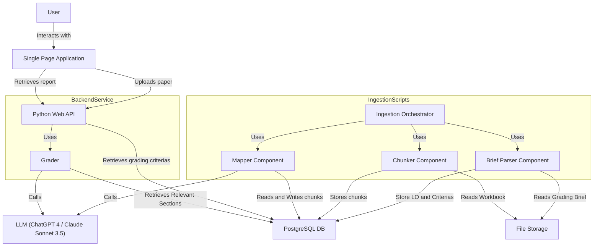
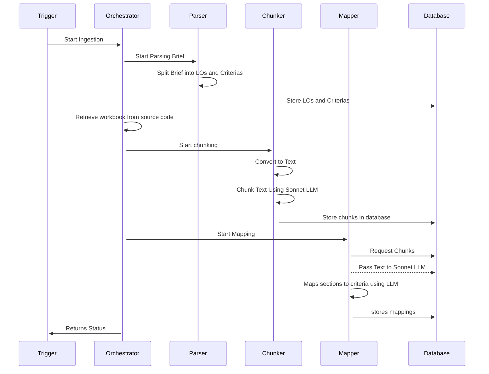
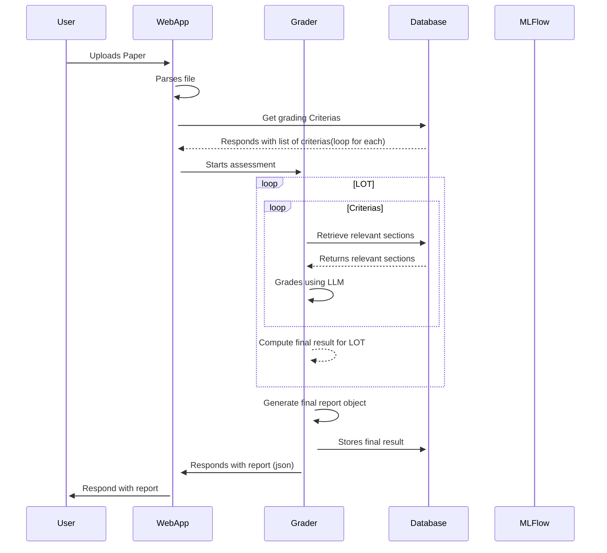
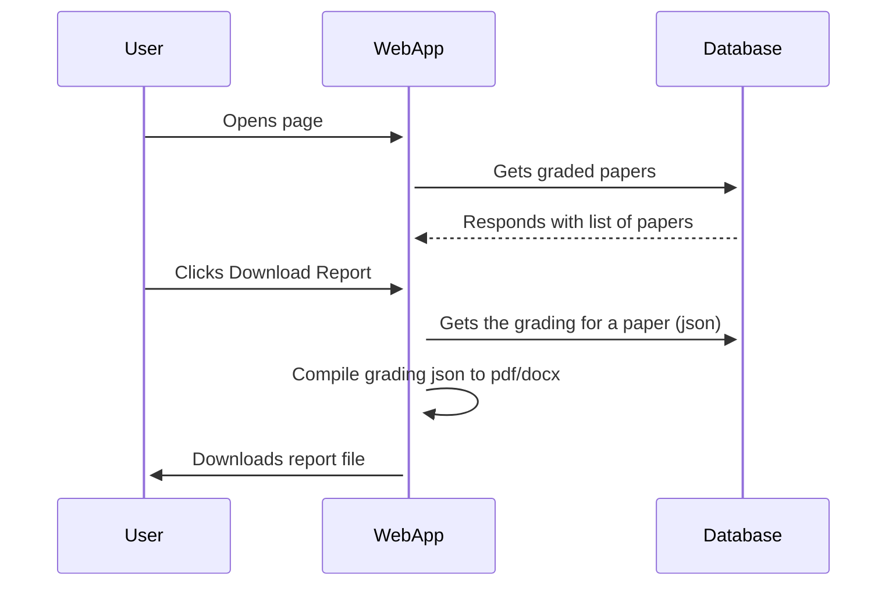
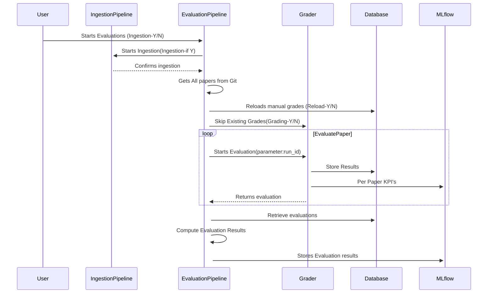

## Architecture

### High Level Architecture

```mermaid
flowchart TB
    direction TB
    
    User["User"]
    LLM["LLM (ChatGPT 4 / Claude Sonnet 3.5)"]
    PostgreSQL["PostgreSQL DB"]
    FileStorage["File Storage"]
    
    WebGui["Single Page Application"]
    WebGui -- "Uploads paper" --> API
    WebGui -- "Retrieves report" --> API
    User -- "Interacts with" --> WebGui

    subgraph IngestionScripts
        Ingestion["Ingestion Orchestrator"]
        Chunker["Chunker Component"]
        Mapper["Mapper Component"]
        BriefParser["Brief Parser Component"]

        Ingestion -- "Uses" --> Chunker
        Ingestion -- "Uses" --> Mapper
        Ingestion -- "Uses" --> BriefParser    
    end

    subgraph BackendService
        API["Python Web API"]            
        Grader["Grader"]
        API -- "Uses" --> Grader
    end 

    BriefParser -- "Reads Grading Brief" --> FileStorage
    BriefParser -- "Store LO and Criterias" --> PostgreSQL
    Chunker -- "Reads Workbook" --> FileStorage
    Chunker -- "Stores chunks" --> PostgreSQL
    Mapper -- "Calls" --> LLM
    Mapper -- "Reads and Writes chunks" --> PostgreSQL
    API -- "Retrieves grading criterias" --> PostgreSQL
    Grader -- "Retrieves Relevant Sections" --> PostgreSQL
    Grader -- "Calls" --> LLM
```

### Flows

#### Ingestion

```mermaid
%% ingestion sequence
 
sequenceDiagram
    participant Trigger
    participant Orchestrator
    participant Parser
    participant Chunker
    participant Mapper
    participant Database
 
    Trigger->>+Orchestrator: Start Ingestion
    Orchestrator->>+Parser: Start Parsing Brief
    Parser->>+Parser: Split Brief into LOs and Criterias
    Parser->>+Database: Store LOs and Criterias
    Orchestrator->>+Orchestrator: Retrieve workbook from source code
    Orchestrator->>+Chunker: Start chunking
    Chunker->>+Chunker: Convert to Text
    Chunker->>+Chunker: Chunk Text Using Sonnet LLM
    Chunker->>+Database: Store chunks in database
    Orchestrator->>+Mapper: Start Mapping
    Mapper->>+Database: Request Chunks
    Mapper-->>+Database: Pass Text to Sonnet LLM
    Mapper->>+Mapper: Maps sections to criteria using LLM
    Mapper->>+Database: stores mappings
    Orchestrator->>+Trigger: Returns Status
```

#### Single Grading

```mermaid
%% Single Grading sequence
 
sequenceDiagram
    participant User
    participant WebApp
    participant Grader
    participant Database
    participant MLFlow
    
 
 
    User->>+WebApp: Uploads Paper
    WebApp->>+WebApp: Parses file
    WebApp->>+Database: Get grading Criterias
    Database-->>+WebApp: Responds with list of criterias(loop for each)
    WebApp->>+Grader: Starts assessment
    loop LOT
        loop Criterias
            Grader->>+Database: Retrieve relevant sections
            Database-->>+Grader: Returns relevant sections
            Grader->>+Grader: Grades using LLM
 
        end
        Grader-->>+Grader: Compute final result for LOT
        
    end
    Grader->>+Grader: Generate final report object
    Grader->>+Database: Stores final result
    Grader->>+WebApp: Responds with report (json)
    WebApp->>+User: Respond with report
```

#### Retrieve Gradings

```mermaid
%% Retrieve Grading sequence
 
sequenceDiagram
    participant User
    participant WebApp
    participant Database
 
    User->>+WebApp: Opens page
    WebApp->>+Database: Gets graded papers
    Database-->>+WebApp: Responds with list of papers

    User->>+WebApp: Clicks Download Report
    WebApp->>+Database: Gets the grading for a paper (json)
    WebApp->>+WebApp: Compile grading json to pdf/docx
    WebApp->>+User: Downloads report file
```

#### Evaluation Pipeline

```mermaid
%% Evaluation Pipeline sequence
 
sequenceDiagram
    participant User
    participant IngestionPipeline
    participant EvaluationPipeline
    participant Grader
    participant Database
    participant MLflow
    
 
 
    User->>+EvaluationPipeline: Starts Evaluations (Ingestion-Y/N)
    EvaluationPipeline->>+IngestionPipeline: Starts Ingestion(Ingestion-if Y)
    IngestionPipeline-->>+EvaluationPipeline: Confirms ingestion
    EvaluationPipeline->>+EvaluationPipeline: Gets All papers from Git
    EvaluationPipeline->>+Database: Reloads manual grades (Reload-Y/N)
    EvaluationPipeline->>+Grader: Skip Existing Grades(Grading-Y/N)
 
    loop EvaluatePaper
        %% EvaluationPipeline->>+EvaluationPipleline: Check existing grading 
        EvaluationPipeline->>+Grader: Starts Evaluation(parameter:run_id)
        Grader->>+Database: Store Results 
        Grader->>+MLflow: Per Paper KPI's
        Grader-->>+EvaluationPipeline: Returns evaluation

 
    end
    EvaluationPipeline->>+Database: Retrieve evaluations
    EvaluationPipeline->>+EvaluationPipeline: Compute Evaluation Results
    EvaluationPipeline->>+MLflow: Stores Evaluation results
```